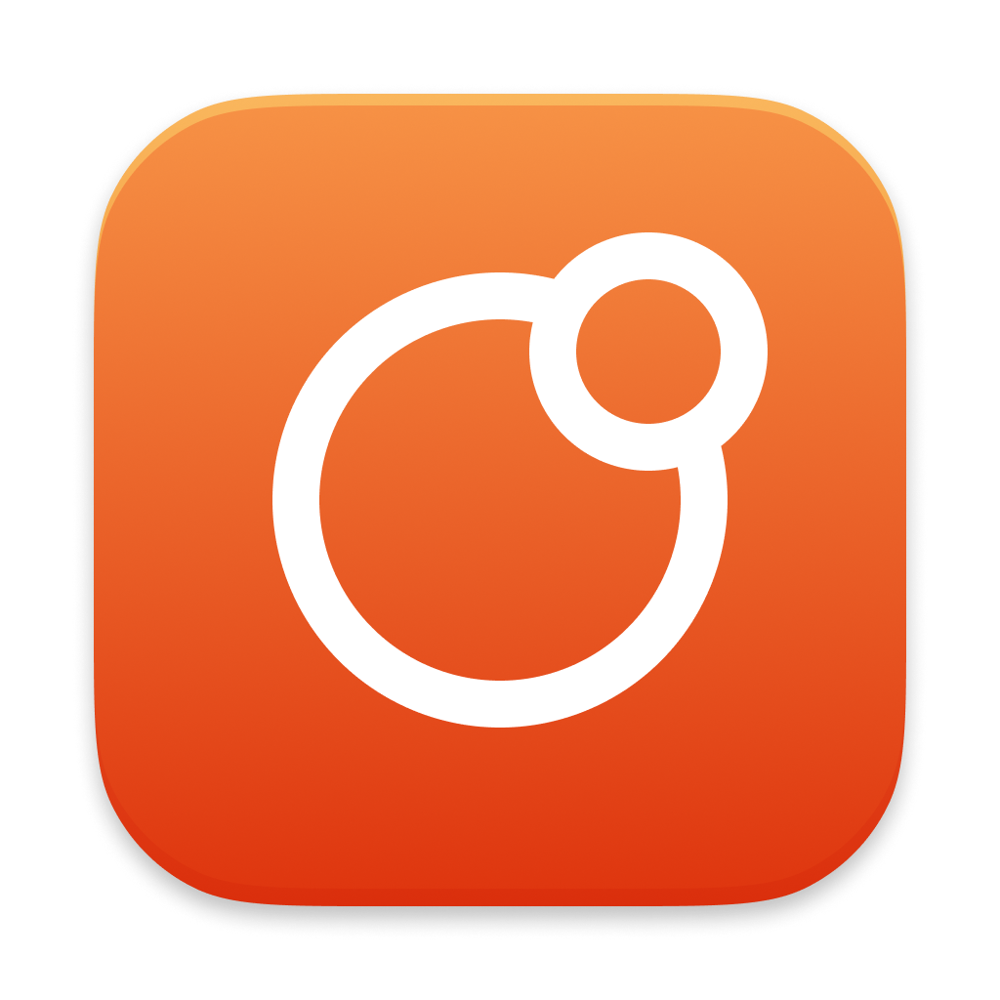

# Opta



A simple macOS app to optimize images, video, and audio.


## Features

### Images
- Drag & drop or select image files (PNG, JPEG, TIFF, GIF, BMP, HEIC, WebP)
- Capture a screenshot of a display or window
- Output as optimized PNG, JPG, or WebP
- Reduce colors: All, 256, 128, 64, 32, 16, 4, 2
- Configurable quality (JPG, WebP)
- Custom output filename suffix
- Strip metadata

### Video
- Drag & drop or select video files (MP4, MOV, AVI, MKV, WebM, M4V, FLV, WMV, TS, MTS)
- Record your screen or a window
- Output as MP4 (H.264), MP4 (H.265), WebM (VP9), MOV, or GIF
- Configurable CRF quality with hints (visually lossless → smaller file) and dimension presets (Original, 1080p, 720p, 480p, 360p)
- Custom output filename suffix
- Strip metadata

### Audio
- Drag & drop or select audio files (MP3, AAC, M4A, FLAC, WAV, OGG, Opus, WMA, AIFF, ALAC)
- Extract audio from video files — with audio track picker (codec, language, channels)
- Output as MP3, AAC, M4A, OGG Vorbis, Opus, FLAC, or WAV
- Configurable bitrate for lossy formats
- Custom output filename suffix
- Strip metadata

### File Management
- Before/after size comparison
- Remove from list (⌫), Move to Trash (⌘⌫), Reveal in Finder
- Quick Look preview (Space)
- Tab labels show a • indicator when there are unprocessed files

### General
- Keyboard shortcuts: ⌘1/2/3 for tab switching, ⌘⌫ trash, ⌫ remove, Space preview, ↵ optimize
- Settings persist across launches
- macOS notification when batch completes

## Install

Requires macOS 15+ and [Homebrew](https://brew.sh).

```sh
/bin/bash -c "$(curl -fsSL https://raw.githubusercontent.com/vladstudio/opta/main/install.sh)"
```

Downloads the latest release and installs the CLI dependencies (`pngquant`, `oxipng`, `webp`, `ffmpeg`) via Homebrew if missing.

## Usage

```bash
open -a Opta
```

## How it works

### Images
1. **Input conversion** (non-PNG only) — `sips` (built into macOS) converts to PNG
2. **Color reduction** (if not "All") — [pngquant](https://pngquant.org/)
3. **PNG optimization** — [oxipng](https://github.com/shssoichern/oxipng) (lossless, level 6)
4. **JPG conversion** — ImageIO (built into macOS, configurable quality)
5. **WebP conversion** — [cwebp](https://developers.google.com/speed/webp/docs/cwebp)

### Video & Audio
Processed via [ffmpeg](https://ffmpeg.org/). Video supports CRF-based quality control, two-pass VP9 encoding, and palette-optimized GIF conversion. Audio supports lossy (MP3, AAC, Vorbis, Opus) and lossless (FLAC, WAV) formats with configurable bitrate and audio track selection for multi-stream video files.

### Screenshots & Screen Recording
Captured via [ScreenCaptureKit](https://developer.apple.com/documentation/screencapturekit) — supports single display or single window. Screenshots save as PNG; recordings save as MOV. Both land on your Desktop.

Output is saved as `{filename}{suffix}.{ext}` in the same directory as the original. Metadata stripping via tool flags.

---

License: MIT
