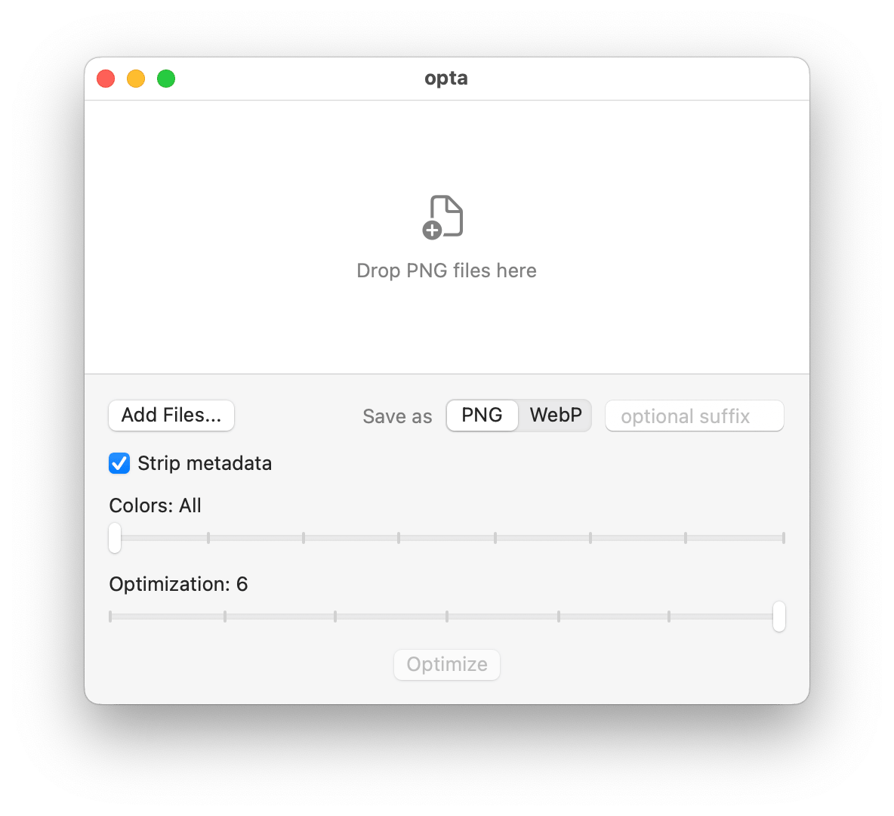

# Opta


A simple macOS app to optimize PNG files. Reduce colors, strip metadata, convert to WebP.



## Features

- Drag & drop or select PNG files
- Reduce colors: All, 256, 128, 64, 32, 16, 4, 2
- Output as optimized PNG or WebP
- Strip metadata
- Configurable optimization level (PNG) / quality (WebP)
- Before/after size comparison

## Install

Requires macOS 13+, Homebrew, and Xcode Command Line Tools.

```bash
git clone https://github.com/vladstudio/opta.git
cd opta
./install.sh
```

This will install CLI dependencies (`pngquant`, `oxipng`, `webp`), build a release binary, and copy it to `/usr/local/bin`.

## Usage

```bash
opta
```

## How it works

1. **Color reduction** (if not "All") — [pngquant](https://pngquant.org/)
2. **PNG optimization** — [oxipng](https://github.com/shssoichern/oxipng) (lossless, configurable level 0–6)
3. **WebP conversion** — [cwebp](https://developers.google.com/speed/webp/docs/cwebp)
4. Metadata stripping via tool flags

Output is saved as `{filename}{suffix}.{ext}` in the same directory as the original.

## License

MIT
